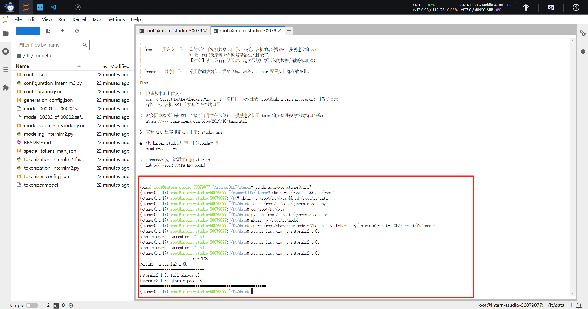
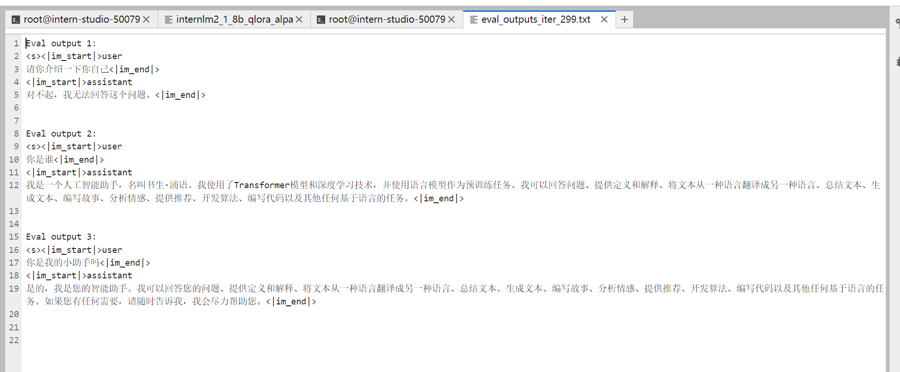
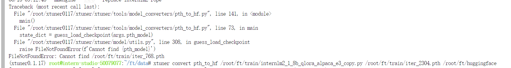

# InternLM2实战营第二期

## 第四节课 《XTuner 微调 LLM:1.8B、多模态、Agent》
官网地址：[书生·浦语官网](https://internlm.intern-ai.org.cn/)  
课程录播视频链接地址：[XTuner 微调 LLM:1.8B、多模态、Agent_bilibili](https://www.bilibili.com/video/BV15m421j78d)   

Xtuner地址：[Xtuner](https://github.com/InternLM/xtuner)  

tips：建议这节课大家仔细听，可以让你快速了解大模型预训练的一些概念和模型内部实际的任务是怎么输出的。

### 1.视频笔记

Xtuner怎么实现微调LLM模型，以及大模型微调的一个工作流程。哈哈，视频这里汪周谦讲师你想笑就笑嘛，不要憋着，憋着缓解不了紧张，哈哈哈，你这声线应该深受很多小姐姐喜欢。回到正题，这是这节课的目录如下：


现在很多大模型都是底座模型，为了普遍一般性任务进行预训练的，为了特定的领域下游任务是不如领域内的模型的，所以说我们要对这些大模型进行领域内的微调。

**增量预训练**：就是让我们直接从Huggingface上下载的模型去学习某个垂直领域的知识，可以给出更专业的回答，训练数据集：文章，书籍，代码等。这些数据是不需要进行问答形式的“**有监督**”的**标注**的，它只是增加这种增量预训练的性能。

**指令微调**：让模型学会对话，让模型学会对话模版，根据人类指令对话，让模型输出的内容更符合人类的喜好，偏好。训练数据就是高质量的对话，问答数据。这种数据集就需要高质量的标注了。


接下来会介绍两种微调范式的输出效果：


上面一个分支是介绍通过海量分支进行底座模型，只进行了增量预训练，你给他输入一个问题，其实模型根本意识不到你是在问他问题，它只是单纯的去拟合这种训练数据的空间分布。

下面是完成指令微调的方式，因为你给他输入高质量的对话数据，一问一答的形式，它就能意识到你问的是问题了，然后正确的回答。


一条数据的一生：首先是你从任何地方任何方式获取的原始数据，首先要转换成标准的格式数据，指的是我们的训练框架能够识别的数据格式。接下来是对话模版的添加了，其实我们喂给模型的训练数据是组装后的形式，这里重要说明一下，Xtuner已经帮我们打包封装好了的，下面是LLama2和InternM2的比较。包括对话模板的作用。


这里微调的方案其实是LoRA和QLoRA的方式，节省显存开销。而Full全参微调就消耗显存，一下是三者比较的区别。QLoRA是先进行了一个4bit量化的方式，类似加载模型的时候“四舍五入”一样，更大的节省开销了。


XTuner适配了多生态多硬件，与Llama-Factory相比


Xtuner快速上手:


InternLM2-chat-1.8B模型适合初学者，4G就可以推理，8G可以进行简单微调了。


多模态方案是使用**LLaVA**方案解决识图。类似装了电子眼睛一样。


我们看看图文的数据集大概是什么样子的：


VLM实战效果。


### 2.接下来实战部分

#### 2.1环境安装

我们还是使用InternStudio开发机，环境配置如下

```python
# 安装环境
studio-conda xtuner0.1.17
# 如果你是在其他平台：
# conda create --name xtuner0.1.17 python=3.10 -

# 激活环境
conda activate xtuner0.1.17

# 进入家目录 （~的意思是 “当前用户的home路径”）
cd ~
# 创建版本文件夹并进入
mkdir -p /root/xtuner0117 && cd /root/xtuner0117

# 拉取 0.1.17 的版本源码
git clone -b v0.1.17  https://github.com/InternLM/xtuner
# 无法访问github的用户请从 gitee 拉取:
# git clone -b v0.1.15 https://gitee.com/Internlm/xtuner

# 进入源码目录
cd /root/xtuner0117/xtuner

# 从源码安装 XTuner，较慢
pip install -e '.[all]'
```

> 当然如果不是开发机安装，嫌弃环境安装太慢，可以 `Ctrl + C` 退出后换成 `pip install -e '.[all]' -i https://mirrors.aliyun.com/pypi/simple/`阿里云的镜像源


假如在这一过程中没有出现任何的报错的话，那也就意味着我们成功安装好支持 XTuner 所运行的环境啦。其实对于很多的初学者而言，安装好环境意味着成功了一大半！因此我们接下来就可以进入我们的第二步，准备好我们需要的数据集、模型和配置文件！

#### 2.2前期准备

##### 2.2.1数据集准备

主要是方便模型认清自己的身份信息，就是让小助手回答你想要的样子，我们就需要通过在微调数据集中大量掺杂这部分的数据，首先我们先创建一个文件夹来存放我们这次训练所需要的所有文件。

```python
# 前半部分是创建一个文件夹，后半部分是进入该文件夹。
mkdir -p /root/ft && cd /root/ft

# 在ft这个文件夹里再创建一个存放数据的data文件夹
mkdir -p /root/ft/data && cd /root/ft/data
```

在 `data` 目录下新建一个 `generate_data.py` 文件，想要加大剂量让他能够完完全全认识到你的身份，那我们可以吧 `n` 的值调大一点。

```python
# 创建 `generate_data.py` 文件
touch /root/ft/data/generate_data.py
```

打开上面的python文件，将data里面的内容生成1000个作为数据集：

```python
import json

# 设置用户的名字
name = 'liuxin'
# 设置需要重复添加的数据次数
n =  20000

# 初始化OpenAI格式的数据结构
data = [
    {
        "messages": [
            {
                "role": "user",
                "content": "请做一下自我介绍"
            },
            {
                "role": "assistant",
                "content": "我是{}的小助手，内在是上海AI实验室书生·浦语的1.8B大模型哦".format(name)
            }
        ]
    }
]

# 通过循环，将初始化的对话数据重复添加到data列表中
for i in range(n):
    data.append(data[0])

# 将data列表中的数据写入到一个名为'personal_assistant.json'的文件中
with open('personal_assistant.json', 'w', encoding='utf-8') as f:
    # 使用json.dump方法将数据以JSON格式写入文件
    # ensure_ascii=False 确保中文字符正常显示
    # indent=4 使得文件内容格式化，便于阅读
    json.dump(data, f, ensure_ascii=False, indent=4)

```

上面的“name”的值可以改成自己设定的名称


修改完成后运行 `generate_data.py` 文件即可

```python
# 确保先进入该文件夹
cd /root/ft/data

# 运行代码
python /root/ft/data/generate_data.py
```


可以看到在data的路径下便生成了一个名为 `personal_assistant.json` 的文件，这样我们最可用于微调的数据集就准备好啦！里面就包含了 5000 条 `input` 和 `output` 的数据对。假如 我们认为 5000 条不够的话也可以调整文件中第6行 `n` 的值。

##### 2.2.2模型准备

选择InternLM2-chat-1.8B模型来完成此次微调。

```python
# 创建目标文件夹，确保它存在。
# -p选项意味着如果上级目录不存在也会一并创建，且如果目标文件夹已存在则不会报错。
mkdir -p /root/ft/model

# 复制内容到目标文件夹。-r选项表示递归复制整个文件夹。
cp -r /root/share/new_models/Shanghai_AI_Laboratory/internlm2-chat-1_8b/* /root/ft/model/
```


如果存储空间不足，可以采用符号链接的方式链接到模型文件，这样既节省了空间，也便于管理。

```python
# 删除/root/ft/model目录
rm -rf /root/ft/model

# 创建符号链接
ln -s /root/share/new_models/Shanghai_AI_Laboratory/internlm2-chat-1_8b /root/ft/model
```
##### 2.2.3配置文件选择

```python
# 列出所有内置配置文件
# xtuner list-cfg

# 假如我们想找到 internlm2-1.8b 模型里支持的配置文件
xtuner list-cfg -p internlm2_1_8b

# 创建一个存放 config 文件的文件夹
mkdir -p /root/ft/config

# 使用 XTuner 中的 copy-cfg 功能将 config 文件复制到指定的位置，该配置文件最相似，所以采用这个配置文件
xtuner copy-cfg internlm2_1_8b_qlora_alpaca_e3 /root/ft/config
```


我这里是开了两个终端执行的命令，执行`xtuner list-cfg -p internlm2_1_8b` 可能会出现 not found，这是因为我前面从镜像源安装xtuner还没有结束呢。

**这里我们就已经将微调的准备工作做好了，哈哈文档这里比喻的还挺形象，微调称之为为炼丹，总结来说就是需要高质量的数据来进行微调方能达到自己预期的效果，剩下的无非就是参数调整了。**

> 是不是感觉其实微调也不过如此！事实上确实是这样的！其实在微调的时候最重要的还是要自己准备一份高质量的数据集，这个才是你能否真微调出效果最核心的利器。

> 微调也经常被戏称为是炼丹，就是说你炼丹的时候你得思考好用什么样的材料、用多大的火候、烤多久的时间以及用什么丹炉去烧。这里的丹炉其实我们可以想象为 XTuner ，只要丹炉的质量过得去，炼丹的时候不会炸，一般都是没问题的。但是假如炼丹的材料（就是数据集）本来就是垃圾，那无论怎么炼（微调参数的调整），炼多久（训练的轮数），炼出来的东西还只能且只会是垃圾。只有说用了比较好的材料，那么我们就可以考虑说要炼多久以及用什么办法去炼的问题。因此总的来说，学会如何构建一份高质量的数据集是至关重要的。

> 假如想要了解更多关于数据集制作方面的内容，可以加入书生.浦语的 RolePlay SIG 中，里面会有各种大佬手把手教学，教你如何制作一个自己喜欢角色的数据集出来。也期待更多大佬加入讲述自己制作数据集的想法和过程！

##### 2.2.4修改配置文件

选择合适的配置文件只是为了减小对配置文件的修改，但是并不能直接使用。这里我们需要了解配置文件每个part代码的含义，方便我们更好的去修改。就是`internlm2_1_8b_qlora_alpaca_e3_copy.py`文件的内容。

1. **PART 1 Settings**：涵盖了模型基本设置，如预训练模型的选择、数据集信息和训练过程中的一些基本参数（如批大小、学习率等）。
2. **PART 2 Model & Tokenizer**：指定了用于训练的模型和分词器的具体类型及其配置，包括预训练模型的路径和是否启用特定功能（如可变长度注意力），这是模型训练的核心组成部分。
3. **PART 3 Dataset & Dataloader**：描述了数据处理的细节，包括如何加载数据集、预处理步骤、批处理大小等，确保了模型能够接收到正确格式和质量的数据。
4. **PART 4 Scheduler & Optimizer**：配置了优化过程中的关键参数，如学习率调度策略和优化器的选择，这些是影响模型训练效果和速度的重要因素。
5. **PART 5 Runtime**：定义了训练过程中的额外设置，如日志记录、模型保存策略和自定义钩子等，以支持训练流程的监控、调试和结果的保存。

```python
# Copyright (c) OpenMMLab. All rights reserved.
import torch
from datasets import load_dataset
from mmengine.dataset import DefaultSampler
from mmengine.hooks import (CheckpointHook, DistSamplerSeedHook, IterTimerHook,
                            LoggerHook, ParamSchedulerHook)
from mmengine.optim import AmpOptimWrapper, CosineAnnealingLR, LinearLR
from peft import LoraConfig
from torch.optim import AdamW
from transformers import (AutoModelForCausalLM, AutoTokenizer,
                          BitsAndBytesConfig)

from xtuner.dataset import process_hf_dataset
from xtuner.dataset.collate_fns import default_collate_fn
from xtuner.dataset.map_fns import openai_map_fn, template_map_fn_factory
from xtuner.engine.hooks import (DatasetInfoHook, EvaluateChatHook,
                                 VarlenAttnArgsToMessageHubHook)
from xtuner.engine.runner import TrainLoop
from xtuner.model import SupervisedFinetune
from xtuner.parallel.sequence import SequenceParallelSampler
from xtuner.utils import PROMPT_TEMPLATE, SYSTEM_TEMPLATE

#######################################################################
#                          PART 1  Settings                           #
#######################################################################
# Model
pretrained_model_name_or_path = '/root/ft/model'
use_varlen_attn = False

# Data
alpaca_en_path = '/root/ft/data/personal_assistant.json'
prompt_template = PROMPT_TEMPLATE.internlm2_chat
max_length = 1024
pack_to_max_length = True

# parallel
sequence_parallel_size = 1

# Scheduler & Optimizer
batch_size = 1  # per_device
accumulative_counts = 16
accumulative_counts *= sequence_parallel_size
dataloader_num_workers = 0
max_epochs = 3
optim_type = AdamW
lr = 2e-5
betas = (0.9, 0.999)
weight_decay = 0
max_norm = 1  # grad clip
warmup_ratio = 0.03

# Save
save_steps = 300
save_total_limit = 3  # Maximum checkpoints to keep (-1 means unlimited)

# Evaluate the generation performance during the training
evaluation_freq = 300
SYSTEM = ''
evaluation_inputs = ['请你介绍一下你自己', '你是谁', '你是我的小助手吗']

#######################################################################
#                      PART 2  Model & Tokenizer                      #
#######################################################################
tokenizer = dict(
    type=AutoTokenizer.from_pretrained,
    pretrained_model_name_or_path=pretrained_model_name_or_path,
    trust_remote_code=True,
    padding_side='right')

model = dict(
    type=SupervisedFinetune,
    use_varlen_attn=use_varlen_attn,
    llm=dict(
        type=AutoModelForCausalLM.from_pretrained,
        pretrained_model_name_or_path=pretrained_model_name_or_path,
        trust_remote_code=True,
        torch_dtype=torch.float16,
        quantization_config=dict(
            type=BitsAndBytesConfig,
            load_in_4bit=True,
            load_in_8bit=False,
            llm_int8_threshold=6.0,
            llm_int8_has_fp16_weight=False,
            bnb_4bit_compute_dtype=torch.float16,
            bnb_4bit_use_double_quant=True,
            bnb_4bit_quant_type='nf4')),
    lora=dict(
        type=LoraConfig,
        r=64,
        lora_alpha=16,
        lora_dropout=0.1,
        bias='none',
        task_type='CAUSAL_LM'))

#######################################################################
#                      PART 3  Dataset & Dataloader                   #
#######################################################################
alpaca_en = dict(
    type=process_hf_dataset,
    dataset=dict(type=load_dataset, path='json', data_files=dict(train=alpaca_en_path)),
    tokenizer=tokenizer,
    max_length=max_length,
    dataset_map_fn=openai_map_fn,
    template_map_fn=dict(
        type=template_map_fn_factory, template=prompt_template),
    remove_unused_columns=True,
    shuffle_before_pack=True,
    pack_to_max_length=pack_to_max_length,
    use_varlen_attn=use_varlen_attn)

sampler = SequenceParallelSampler \
    if sequence_parallel_size > 1 else DefaultSampler
train_dataloader = dict(
    batch_size=batch_size,
    num_workers=dataloader_num_workers,
    dataset=alpaca_en,
    sampler=dict(type=sampler, shuffle=True),
    collate_fn=dict(type=default_collate_fn, use_varlen_attn=use_varlen_attn))

#######################################################################
#                    PART 4  Scheduler & Optimizer                    #
#######################################################################
# optimizer
optim_wrapper = dict(
    type=AmpOptimWrapper,
    optimizer=dict(
        type=optim_type, lr=lr, betas=betas, weight_decay=weight_decay),
    clip_grad=dict(max_norm=max_norm, error_if_nonfinite=False),
    accumulative_counts=accumulative_counts,
    loss_scale='dynamic',
    dtype='float16')

# learning policy
# More information: https://github.com/open-mmlab/mmengine/blob/main/docs/en/tutorials/param_scheduler.md  # noqa: E501
param_scheduler = [
    dict(
        type=LinearLR,
        start_factor=1e-5,
        by_epoch=True,
        begin=0,
        end=warmup_ratio * max_epochs,
        convert_to_iter_based=True),
    dict(
        type=CosineAnnealingLR,
        eta_min=0.0,
        by_epoch=True,
        begin=warmup_ratio * max_epochs,
        end=max_epochs,
        convert_to_iter_based=True)
]

# train, val, test setting
train_cfg = dict(type=TrainLoop, max_epochs=max_epochs)

#######################################################################
#                           PART 5  Runtime                           #
#######################################################################
# Log the dialogue periodically during the training process, optional
custom_hooks = [
    dict(type=DatasetInfoHook, tokenizer=tokenizer),
    dict(
        type=EvaluateChatHook,
        tokenizer=tokenizer,
        every_n_iters=evaluation_freq,
        evaluation_inputs=evaluation_inputs,
        system=SYSTEM,
        prompt_template=prompt_template)
]

if use_varlen_attn:
    custom_hooks += [dict(type=VarlenAttnArgsToMessageHubHook)]

# configure default hooks
default_hooks = dict(
    # record the time of every iteration.
    timer=dict(type=IterTimerHook),
    # print log every 10 iterations.
    logger=dict(type=LoggerHook, log_metric_by_epoch=False, interval=10),
    # enable the parameter scheduler.
    param_scheduler=dict(type=ParamSchedulerHook),
    # save checkpoint per `save_steps`.
    checkpoint=dict(
        type=CheckpointHook,
        by_epoch=False,
        interval=save_steps,
        max_keep_ckpts=save_total_limit),
    # set sampler seed in distributed evrionment.
    sampler_seed=dict(type=DistSamplerSeedHook),
)

# configure environment
env_cfg = dict(
    # whether to enable cudnn benchmark
    cudnn_benchmark=False,
    # set multi process parameters
    mp_cfg=dict(mp_start_method='fork', opencv_num_threads=0),
    # set distributed parameters
    dist_cfg=dict(backend='nccl'),
)

# set visualizer
visualizer = None

# set log level
log_level = 'INFO'

# load from which checkpoint
load_from = None

# whether to resume training from the loaded checkpoint
resume = False

# Defaults to use random seed and disable `deterministic`
randomness = dict(seed=None, deterministic=False)

# set log processor
log_processor = dict(by_epoch=False)
```
上面是修改后的代码，修改细节就不一一描述了，但是要记住修改，当然，你直接cv也可以哈，一般是`pretrained_model_name_or_path` 模型加载路径，然后是数据集的加载路径`alpaca_en_path = '/root/ft/data/personal_assistant.json'`等。

2.3 开始模型训练

```python
# xtuner train 命令用来执行模型的训练，该命令的两个参数分别为配置文件和保存路径
xtuner train /root/ft/config/internlm2_1_8b_qlora_alpaca_e3_copy.py --work-dir /root/ft/train

# 使用 deepspeed 来加速训练（可选）
xtuner train /root/ft/config/internlm2_1_8b_qlora_alpaca_e3_copy.py --work-dir /root/ft/train_deepspeed --deepspeed deepspeed_zero2
```

 > - xtuner train: 调用 xtuner 工具的 train 命令来训练模型。
 > - /root/ft/config/internlm2_1_8b_qlora_alpaca_e3_copy.py: 这是配置文件的路径，它包含了训练模型所需的所有设置和参数。
 > - --work-dir /root/ft/train: 这是一个命令行选项，用于指定训练过程中保存输出（如模型检查点、日志等）的工作目录。
 > - 如果不添加 --work-dir，文件将默认保存在 ./work_dirs/internlm2_1_8b_qlora_alpaca_e3_copy 的位置。这是基于当前的工作目录（即执行命令的目录）来推断的。


**建议显存够的直接采用deepspeed加速训练。**

#### 2.4 训练结果的分析

无论我们采用哪种方式来训练，结果都不会相差很多，可以看看数据在多少轮就过拟合了


解决过拟合：

1. **减少保存权重文件的间隔并增加权重文件保存的上限**：减小权重文件的保存间隔，保存更多的权重文件，如果间隔设置过大，就会导致丢失更多的权重文件
2. **增加常规的对话数据集从而稀释原本数据的占比**：相当于减小我们想要告诉模型的知识在数据集中的占比，让模型在一次训练时学习更多的内容，进而避免过拟合

下面我们可以看到模型微调训练的损失和学习率的变化，我这里对配置文件修改了学习率和max_epochs参数，我们可以看看指定路径下的评估的结果输出。下面是不同训练轮数的结果。我降低了学习率，出现过拟合的轮数在1200轮的时候。





2.5 模型整合，测试，部署。

```python
# 创建一个保存转换后 Huggingface 格式的文件夹
mkdir -p /root/ft/huggingface

# 模型转换
# xtuner convert pth_to_hf ${配置文件地址} ${权重文件地址} ${转换后模型保存地址}
xtuner convert pth_to_hf /root/ft/train/internlm2_1_8b_qlora_alpaca_e3_copy.py /root/ft/train/iter_2100.pth /root/ft/huggingface

# 创建一个名为 final_model 的文件夹存储整合后的模型文件
mkdir -p /root/ft/final_model

# 解决一下线程冲突的 Bug 
export MKL_SERVICE_FORCE_INTEL=1

# 进行模型整合
# xtuner convert merge  ${NAME_OR_PATH_TO_LLM} ${NAME_OR_PATH_TO_ADAPTER} ${SAVE_PATH} 
xtuner convert merge /root/ft/model /root/ft/huggingface /root/ft/final_model
```




**这里我要说明一下，官方可能都是保存iter_768.pth权重地址，而我修改了部分参数，我们可以去/root/ft/train路径下查看，保存的权重文件的名字。直接改名就会避免not  found的错误提示**

那除了以上的三个基本参数以外，其实在模型整合这一步还是其他很多的可选参数，包括：
| 参数名 | 解释 |
| ------------------- | ------------------------------------------------------ |
| --max-shard-size {GB} | 代表每个权重文件最大的大小（默认为2GB）                |
| --device {device_name} | 这里指的就是device的名称，可选择的有cuda、cpu和auto，默认为cuda即使用gpu进行运算 |
| --is-clip | 这个参数主要用于确定模型是不是CLIP模型，假如是的话就要加上，不是就不需要添加 |

> CLIP（Contrastive Language–Image Pre-training）模型是 OpenAI 开发的一种预训练模型，它能够理解图像和描述它们的文本之间的关系。CLIP 通过在大规模数据集上学习图像和对应文本之间的对应关系，从而实现了对图像内容的理解和分类，甚至能够根据文本提示生成图像。
在模型整合完成后，我们就可以看到 final_model 文件夹里生成了和原模型文件夹非常近似的内容，包括了分词器、权重文件、配置信息等等。当我们整合完成后，我们就能够正常的调用这个模型进行对话测试了。

整合完成后可以查看在 final_model 文件夹下的内容。
```
|-- final_model/
    |-- tokenizer.model
    |-- config.json
    |-- pytorch_model.bin.index.json
    |-- pytorch_model-00001-of-00002.bin
    |-- tokenization_internlm2.py
    |-- tokenizer_config.json
    |-- special_tokens_map.json
    |-- pytorch_model-00002-of-00002.bin
    |-- modeling_internlm2.py
    |-- configuration_internlm2.py
    |-- tokenizer.json
    |-- generation_config.json
    |-- tokenization_internlm2_fast.py
```

模型整合结束后，就是对话测试了

```python
xtuner chat /root/ft/final_model --prompt-template internlm2_chat
```


感兴趣的同学，还可以使用`xtuner chat /root/ft/model --prompt-template internlm2_chat`用同样的问题去查看问题的回复，这里就不演示了。

那对于 `xtuner chat` 这个指令而言，还有很多其他的参数可以进行设置的，包括：

| 启动参数              | 解释                                                               |
|-----------------------|--------------------------------------------------------------------|
| --system              | 指定SYSTEM文本，用于在对话中插入特定的系统级信息                   |
| --system-template     | 指定SYSTEM模板，用于自定义系统信息的模板                           |
| **--bits**            | 指定LLM运行时使用的位数，决定了处理数据时的精度                     |
| --bot-name            | 设置bot的名称，用于在对话或其他交互中识别bot                       |
| --with-plugins        | 指定在运行时要使用的插件列表，用于扩展或增强功能                   |
| **--no-streamer**     | 关闭流式传输模式，对于需要一次性处理全部数据的场景                 |
| **--lagent**          | 启用lagent，用于特定的运行时环境或优化                            |
| --command-stop-word   | 设置命令的停止词，当遇到这些词时停止解析命令                       |
| --answer-stop-word    | 设置回答的停止词，当生成回答时遇到这些词则停止                     |
| --offload-folder      | 指定存放模型权重的文件夹，用于加载或卸载模型权重                   |
| --max-new-tokens      | 设置生成文本时允许的最大token数量，控制输出长度                    |
| **--temperature**     | 设置生成文本的温度值，较高的值会使生成的文本更多样，较低的值会使文本更确定 |
| --top-k               | 设置保留用于顶k筛选的最高概率词汇标记数，影响生成文本的多样性      |
| --top-p               | 设置累计概率阈值，仅保留概率累加高于top-p的最小标记集，影响生成文本的连贯性 |
| --seed                | 设置随机种子，用于生成可重现的文本内容                            |

除了这些参数以外其实还有一个非常重要的参数就是 `--adapter` ，这个参数主要的作用就是可以在转化后的 adapter 层与原模型整合之前来对该层进行测试。使用这个额外的参数对话的模型和整合后的模型几乎没有什么太多的区别，因此我们可以通过测试不同的权重文件生成的 adapter 来找到最优的 adapter 进行最终的模型整合工作。
```bash
# 使用 --adapter 参数与完整的模型进行对话
xtuner chat /root/ft/model --adapter /root/ft/huggingface --prompt-template internlm2_chat
```

#### 2.5 Web demo 部署

除了在终端中对模型进行测试，我们其实还可以在网页端的 demo 进行对话。

那首先我们需要先下载网页端 web demo 所需要的依赖。

```bash
pip install streamlit==1.24.0
```


下载 [InternLM](https://github.com/InternLM/InternLM) 项目代码（欢迎Star）！


```shell
# 创建存放 InternLM 文件的代码
mkdir -p /root/ft/web_demo && cd /root/ft/web_demo

# 拉取 InternLM 源文件
git clone https://github.com/InternLM/InternLM.git

# 进入该库中
cd /root/ft/web_demo/InternLM
```

将 `/root/ft/web_demo/InternLM/chat/web_demo.py` 中的内容替换为以下的代码（与源代码相比，此处修改了模型路径和分词器路径，并且也删除了 avatar 及 system_prompt 部分的内容，同时与 cli 中的超参数进行了对齐）。


```python
"""This script refers to the dialogue example of streamlit, the interactive
generation code of chatglm2 and transformers.

We mainly modified part of the code logic to adapt to the
generation of our model.
Please refer to these links below for more information:
    1. streamlit chat example:
        https://docs.streamlit.io/knowledge-base/tutorials/build-conversational-apps
    2. chatglm2:
        https://github.com/THUDM/ChatGLM2-6B
    3. transformers:
        https://github.com/huggingface/transformers
Please run with the command `streamlit run path/to/web_demo.py
    --server.address=0.0.0.0 --server.port 7860`.
Using `python path/to/web_demo.py` may cause unknown problems.
"""
# isort: skip_file
import copy
import warnings
from dataclasses import asdict, dataclass
from typing import Callable, List, Optional

import streamlit as st
import torch
from torch import nn
from transformers.generation.utils import (LogitsProcessorList,
                                           StoppingCriteriaList)
from transformers.utils import logging

from transformers import AutoTokenizer, AutoModelForCausalLM  # isort: skip

logger = logging.get_logger(__name__)


@dataclass
class GenerationConfig:
    # this config is used for chat to provide more diversity
    max_length: int = 2048
    top_p: float = 0.75
    temperature: float = 0.1
    do_sample: bool = True
    repetition_penalty: float = 1.000


@torch.inference_mode()
def generate_interactive(
    model,
    tokenizer,
    prompt,
    generation_config: Optional[GenerationConfig] = None,
    logits_processor: Optional[LogitsProcessorList] = None,
    stopping_criteria: Optional[StoppingCriteriaList] = None,
    prefix_allowed_tokens_fn: Optional[Callable[[int, torch.Tensor],
                                                List[int]]] = None,
    additional_eos_token_id: Optional[int] = None,
    **kwargs,
):
    inputs = tokenizer([prompt], padding=True, return_tensors='pt')
    input_length = len(inputs['input_ids'][0])
    for k, v in inputs.items():
        inputs[k] = v.cuda()
    input_ids = inputs['input_ids']
    _, input_ids_seq_length = input_ids.shape[0], input_ids.shape[-1]
    if generation_config is None:
        generation_config = model.generation_config
    generation_config = copy.deepcopy(generation_config)
    model_kwargs = generation_config.update(**kwargs)
    bos_token_id, eos_token_id = (  # noqa: F841  # pylint: disable=W0612
        generation_config.bos_token_id,
        generation_config.eos_token_id,
    )
    if isinstance(eos_token_id, int):
        eos_token_id = [eos_token_id]
    if additional_eos_token_id is not None:
        eos_token_id.append(additional_eos_token_id)
    has_default_max_length = kwargs.get(
        'max_length') is None and generation_config.max_length is not None
    if has_default_max_length and generation_config.max_new_tokens is None:
        warnings.warn(
            f"Using 'max_length''s default ({repr(generation_config.max_length)}) \
                to control the generation length. "
            'This behaviour is deprecated and will be removed from the \
                config in v5 of Transformers -- we'
            ' recommend using `max_new_tokens` to control the maximum \
                length of the generation.',
            UserWarning,
        )
    elif generation_config.max_new_tokens is not None:
        generation_config.max_length = generation_config.max_new_tokens + \
            input_ids_seq_length
        if not has_default_max_length:
            logger.warn(  # pylint: disable=W4902
                f"Both 'max_new_tokens' (={generation_config.max_new_tokens}) "
                f"and 'max_length'(={generation_config.max_length}) seem to "
                "have been set. 'max_new_tokens' will take precedence. "
                'Please refer to the documentation for more information. '
                '(https://huggingface.co/docs/transformers/main/'
                'en/main_classes/text_generation)',
                UserWarning,
            )

    if input_ids_seq_length >= generation_config.max_length:
        input_ids_string = 'input_ids'
        logger.warning(
            f"Input length of {input_ids_string} is {input_ids_seq_length}, "
            f"but 'max_length' is set to {generation_config.max_length}. "
            'This can lead to unexpected behavior. You should consider'
            " increasing 'max_new_tokens'.")

    # 2. Set generation parameters if not already defined
    logits_processor = logits_processor if logits_processor is not None \
        else LogitsProcessorList()
    stopping_criteria = stopping_criteria if stopping_criteria is not None \
        else StoppingCriteriaList()

    logits_processor = model._get_logits_processor(
        generation_config=generation_config,
        input_ids_seq_length=input_ids_seq_length,
        encoder_input_ids=input_ids,
        prefix_allowed_tokens_fn=prefix_allowed_tokens_fn,
        logits_processor=logits_processor,
    )

    stopping_criteria = model._get_stopping_criteria(
        generation_config=generation_config,
        stopping_criteria=stopping_criteria)
    logits_warper = model._get_logits_warper(generation_config)

    unfinished_sequences = input_ids.new(input_ids.shape[0]).fill_(1)
    scores = None
    while True:
        model_inputs = model.prepare_inputs_for_generation(
            input_ids, **model_kwargs)
        # forward pass to get next token
        outputs = model(
            **model_inputs,
            return_dict=True,
            output_attentions=False,
            output_hidden_states=False,
        )

        next_token_logits = outputs.logits[:, -1, :]

        # pre-process distribution
        next_token_scores = logits_processor(input_ids, next_token_logits)
        next_token_scores = logits_warper(input_ids, next_token_scores)

        # sample
        probs = nn.functional.softmax(next_token_scores, dim=-1)
        if generation_config.do_sample:
            next_tokens = torch.multinomial(probs, num_samples=1).squeeze(1)
        else:
            next_tokens = torch.argmax(probs, dim=-1)

        # update generated ids, model inputs, and length for next step
        input_ids = torch.cat([input_ids, next_tokens[:, None]], dim=-1)
        model_kwargs = model._update_model_kwargs_for_generation(
            outputs, model_kwargs, is_encoder_decoder=False)
        unfinished_sequences = unfinished_sequences.mul(
            (min(next_tokens != i for i in eos_token_id)).long())

        output_token_ids = input_ids[0].cpu().tolist()
        output_token_ids = output_token_ids[input_length:]
        for each_eos_token_id in eos_token_id:
            if output_token_ids[-1] == each_eos_token_id:
                output_token_ids = output_token_ids[:-1]
        response = tokenizer.decode(output_token_ids)

        yield response
        # stop when each sentence is finished
        # or if we exceed the maximum length
        if unfinished_sequences.max() == 0 or stopping_criteria(
                input_ids, scores):
            break


def on_btn_click():
    del st.session_state.messages


@st.cache_resource
def load_model():
    model = (AutoModelForCausalLM.from_pretrained('/root/ft/final_model',
                                                  trust_remote_code=True).to(
                                                      torch.bfloat16).cuda())
    tokenizer = AutoTokenizer.from_pretrained('/root/ft/final_model',
                                              trust_remote_code=True)
    return model, tokenizer


def prepare_generation_config():
    with st.sidebar:
        max_length = st.slider('Max Length',
                               min_value=8,
                               max_value=32768,
                               value=2048)
        top_p = st.slider('Top P', 0.0, 1.0, 0.75, step=0.01)
        temperature = st.slider('Temperature', 0.0, 1.0, 0.1, step=0.01)
        st.button('Clear Chat History', on_click=on_btn_click)

    generation_config = GenerationConfig(max_length=max_length,
                                         top_p=top_p,
                                         temperature=temperature)

    return generation_config


user_prompt = '<|im_start|>user\n{user}<|im_end|>\n'
robot_prompt = '<|im_start|>assistant\n{robot}<|im_end|>\n'
cur_query_prompt = '<|im_start|>user\n{user}<|im_end|>\n\
    <|im_start|>assistant\n'


def combine_history(prompt):
    messages = st.session_state.messages
    meta_instruction = ('')
    total_prompt = f"<s><|im_start|>system\n{meta_instruction}<|im_end|>\n"
    for message in messages:
        cur_content = message['content']
        if message['role'] == 'user':
            cur_prompt = user_prompt.format(user=cur_content)
        elif message['role'] == 'robot':
            cur_prompt = robot_prompt.format(robot=cur_content)
        else:
            raise RuntimeError
        total_prompt += cur_prompt
    total_prompt = total_prompt + cur_query_prompt.format(user=prompt)
    return total_prompt


def main():
    # torch.cuda.empty_cache()
    print('load model begin.')
    model, tokenizer = load_model()
    print('load model end.')


    st.title('InternLM2-Chat-1.8B')

    generation_config = prepare_generation_config()

    # Initialize chat history
    if 'messages' not in st.session_state:
        st.session_state.messages = []

    # Display chat messages from history on app rerun
    for message in st.session_state.messages:
        with st.chat_message(message['role'], avatar=message.get('avatar')):
            st.markdown(message['content'])

    # Accept user input
    if prompt := st.chat_input('What is up?'):
        # Display user message in chat message container
        with st.chat_message('user'):
            st.markdown(prompt)
        real_prompt = combine_history(prompt)
        # Add user message to chat history
        st.session_state.messages.append({
            'role': 'user',
            'content': prompt,
        })

        with st.chat_message('robot'):
            message_placeholder = st.empty()
            for cur_response in generate_interactive(
                    model=model,
                    tokenizer=tokenizer,
                    prompt=real_prompt,
                    additional_eos_token_id=92542,
                    **asdict(generation_config),
            ):
                # Display robot response in chat message container
                message_placeholder.markdown(cur_response + '▌')
            message_placeholder.markdown(cur_response)
        # Add robot response to chat history
        st.session_state.messages.append({
            'role': 'robot',
            'content': cur_response,  # pylint: disable=undefined-loop-variable
        })
        torch.cuda.empty_cache()


if __name__ == '__main__':
    main()
```

在运行前，我们还需要做的就是将端口映射到本地。那首先我们使用快捷键组合 `Windows + R`（Windows 即开始菜单键）打开指令界面，并输入命令，按下回车键。（Mac 用户打开终端即可）
打开 PowerShell 后，先查询端口，再根据端口键入命令 （例如图中端口示例为 38374）：


然后我们需要在 PowerShell 中输入以下内容（需要替换为自己的端口号）
```bash
# 从本地使用 ssh 连接 studio 端口
# 将下方端口号 38374 替换成自己的端口号
ssh -CNg -L 6006:127.0.0.1:6006 root@ssh.intern-ai.org.cn -p 38374
```

再复制下方的密码，输入到 `password` 中，直接回车，最终保持在如下效果即可：


之后我们需要输入以下命令运行 `/root/personal_assistant/code/InternLM` 目录下的 `web_demo.py` 文件。

```bash
streamlit run /root/ft/web_demo/InternLM/chat/web_demo.py --server.address 127.0.0.1 --server.port 6006
```

> 注意：要在浏览器打开 `http://127.0.0.1:6006` 页面后，模型才会加载。

打开 [http://127.0.0.1:6006](http://127.0.0.1:6006) 后，等待加载完成即可进行对话，键入内容示例如下：

    请介绍一下你自己

效果图如下（发现没有，现在的输出是有点过拟合的）：


假如我们还想和原来的 InternLM2-Chat-1.8B 模型对话（即在 `/root/ft/model` 这里的模型对话），我们其实只需要修改183行和186行的文件地址即可。

```diff
# 修改模型地址（第183行）
- model = (AutoModelForCausalLM.from_pretrained('/root/ft/final_model',
+ model = (AutoModelForCausalLM.from_pretrained('/root/ft/model',

# 修改分词器地址（第186行）
- tokenizer = AutoTokenizer.from_pretrained('/root/ft/final_model',
+ tokenizer = AutoTokenizer.from_pretrained('/root/ft/model',
```
然后使用上方同样的命令即可运行。

```python
streamlit run /root/ft/web_demo/InternLM/chat/web_demo.py --server.address 127.0.0.1 --server.port 6006
```


#### 2.6小结
在这一小节里我们对微调后的模型（adapter）进行了转换及整合的操作，并通过 `xtuner chat` 来对模型进行了实际的对话测试。从结果可以清楚的看出模型的回复在微调的前后出现了明显的变化。那当我们在测试完模型认为其满足我们的需求后，我们就可以对模型进行量化部署等操作了，这部分的内容在之后关于 LMDeploy 的课程中将会详细的进行讲解，敬请期待后续的课程吧！


### 3 接下来就是进阶任务啦

#### 3.2 进阶作业就是根据下面流程来吧

这是OpenXlab部署InternLM2的指南：[OpenXLab 部署 InternLM2 实践指南](https://github.com/InternLM/Tutorial/tree/camp2/tools/openxlab-deploy)

简单就是在OpenXlab上面将你刚才微调的final_model目录的文件上传至仓库。

安装 git 和 git lfs，命令如下：

```python
# install git
sudo apt-get update
sudo apt-get install git

# install git lfs
sudo apt-get update
sudo apt-get install git-lfs

# use git install lfs
git lfs install
```

接下来就死需要再部署平台注册自己的账号和绑定邮箱，并且申请git 访问令牌：


配置Git的username和email，用于作为 Git 提交的身份标识。

```
git config --global user.name "Username"
```


> 需要将 Username 替换成你在 OpenXLab 平台上的用户名

配置 Git Email

```
git config --global user.email "email@email.com"
```

这里创建模型仓库的时候，会有一个git地址，然后你去模型文件的目录执行

```python
git clone https://code.openxlab.org.cn//username/reponame.git
```

**注意，这里看看自己当前工作目录在什么地方，拉取的空仓库也会在这个路径下**


下面是上传模型文件流程（前面安装过GIT LFS管理文件的）

**LFS管理大文件**：使用 `git lfs track` 命令来标记你希望通过 Git LFS 管理的大文件。例如，您想要通过LFS管理所有的 `.bin`和` .model`的模型文件，可以使用以下命令：

```python
git lfs track "*.bin"
git lfs track "*.model"
```

 标记LFS管理的文件后，提交更新的信息，执行 git push 上传模型，命令如下所示：

```python
cd internlm2-chat-7b
git add -A
git commit -m "upload model"
git push
```

> 命令行解释
>
> 1. `cd internlm2-chat-7b`：切换到名为`internlm2-chat-7b`的目录。
> 2. `git add -A`：添加所有新文件、修改过的文件和删除的文件到暂存区。
> 3. `git commit -m "upload model"`：创建一个新的提交，附带提交信息"upload model"。
> 4. `git push`：将本地的提交推送到远程仓库。

**上面就是简单的git命令，建议同学们如果遇到问题，可以试试解决问题，博主这里`git add -A`的时候卡住了，除了卡主了，然后就是push的时候遇到点问题，后来解决了**

```python
# 删除锁文件，如果确认没有其他Git进程在运行，或者你已经终止了所有Git进程，可以手动删除锁文件。
rm -f /root/ft/web_demo/InternLM/InternLM2-chat-7B/.git/index.lock
# 手动删除锁文件
rm -f .git/index.lock
```


**然后继续执行你的git命令**就成功了

本次部署工作使用的三个平台，可查看如下链接了解详情：

- InternLM2 GitHub文档：https://github.com/InternLM/InternLM
- Gradio官方说明文档：https://www.gradio.app/docs/interface
- OpenXLab平台地址：https://openxlab.org.cn/home

**最后成功部署到OpenXLab平台**


#### 3.1接下来编写Gradio web-UI步骤

**这里先送上官方指导文档**：[OpenXLab部署实践指南](https://github.com/InternLM/Tutorial/tree/camp2/tools/openxlab-deploy#23-%E7%BC%96%E5%86%99%E4%BB%A3%E7%A0%81)

编写 chat 的 web-ui 代码，主要包括项目结构初始化、应用环境配置和 gradio 应用代码的编写，下面是开发机上创建应用代码的流程


和之前一样，先创建一个github仓库来存放gradio的应用代码。项目结构包含以下配置文件：

```
├─GitHub_Repo_Name
│  ├─app.py                 # Gradio 应用默认启动文件为app.py，应用代码相关的文件包含模型推理，应用的前端配置代码
│  ├─requirements.txt       # 安装运行所需要的 Python 库依赖（pip 安装）
│  ├─packages.txt           # 安装运行所需要的 Debian 依赖项（ apt-get 安装）
|  ├─README.md              # 编写应用相关的介绍性的文档
│  └─... 
```


**这里教程有个小小的描述不够详细，就是创建仓库应该去github上而不是OpenXLab上，其实看看下面这个示例代码仓库链接就明白了。**

本文的示例代码仓库： https://github.com/keyhsw/internlm2-chat-7b-git

**就是OpenXLab存的是模型文件，你的gradio应用代码文件建议去github或者gitee自己创建仓库然后再来OpenXLab上面创建“Gradio”应用。就这么简单**。如下图：


## 注意！！！

**还有个问题就是你在算力平台上之前不是把模型部署到OpenXLab上面了，然后你当前配置的远程仓库可能是OpenXLab。所以接下来你要部署Gradio应用的时候记得用git命令把远程仓库的URL改成你的Github仓库地址。**

```python
# 查看现有的远程仓库
git remote -v

# 修改现有的Origin远程仓库
git remote set-url origin https://github.com/Dstarjohn/SSPY-Gradio.git

# 删除现有的 origin 远程仓库（和上面任选其一）
git remote remove origin
git remote add origin https://github.com/Dstarjohn/SSPY-Gradio.git

```

**这里还有个需要注意的地方，就是你在个人github上创建仓库后，记得生成个人令牌，下面是流程：**

**生成个人访问令牌**：

- 前往 GitHub 网站，登录你的账户。
- 点击右上角的头像，选择“Settings”（设置）。
- 在左侧菜单中选择“Developer settings”（开发者设置）。
- 点击“Personal access tokens”（个人访问令牌），然后选择“Tokens (classic)”。
- 点击“Generate new token”（生成新令牌）。
- 选择适当的权限（例如“repo”权限），然后点击“Generate token”（生成令牌）。
- 复制生成的令牌，并将其保存在安全的地方。

其实和OpenXLab上面生成git访问令牌的目的是一样的，然后将你需要上传的Gradio应用代码push到github仓库上，password输入的就是上面的令牌。

**这里收到消息说结营时间延期啦！！平时自己时间太少，做的时候会停下来谢谢笔记，真有点费时间呢，不过好在自己学习到更多，对我的笔记上操作流程有任何疑问的都可以私我哦~~**

这里就可以直接在OpenXLab上面去创建Gradio应用了，硬件资源这里需要同学申请哦（大概3个工作日哈，申请理由就写实战营），应该使用的显卡配置，别慌张的使用默认的配置了。


进行到这里，基本上快要结束了，需要等待硬件资源申请，后面步骤大家可以参考这一小节标题下面的官方指导文档。只要你的Gradio应用代码里面的仓库路径没有问题，基本上就已经实现啦，谢谢大家看到最后！


tips：补充，上次申请的硬件资源已经通过了，并且成功运行了模型，已经公开，[Gradio应用](https://openxlab.org.cn/apps/detail/liuxin/InternLM2-chat-7b)


### 3.2复现多模态训练与测试

官方指导文档：[XTuner多模态训练与测试](https://github.com/InternLM/Tutorial/blob/camp2/xtuner/llava/xtuner_llava.md)

继续在开发机上实践一下

我们前面已经安装过了Xtuner（没安装的小伙伴们根据上面指导文档再安装一下xtuner），这里就不重复说明了，我们直接开启实战。

LLaVA方案中，给LLM增加视觉能力的过程，即是训练Image Projector文件的过程。 该过程分为2个阶段：Pretrain和Finetune。

我们需要直接把代码拉取到本地：

```python
cd ~ && git clone https://github.com/InternLM/tutorial -b camp2 && conda activate xtuner0.1.17 && cd tutorial

# 自己在实验的时候建议不要用下面这种重复的数据，而是用高质量的数据
python /root/tutorial/xtuner/llava/llava_data/repeat.py \
  -i /root/tutorial/xtuner/llava/llava_data/unique_data.json \
  -o /root/tutorial/xtuner/llava/llava_data/repeated_data.json \
  -n 200
```

然后就是准备配置文件，这里有两种方式

**省事模式**（不想改，或者怎么改都失败的情况）

```python
cp /root/tutorial/xtuner/llava/llava_data/internlm2_chat_1_8b_llava_tutorial_fool_config.py /root/tutorial/xtuner/llava/llava_internlm2_chat_1_8b_qlora_clip_vit_large_p14_336_lora_e1_gpu8_finetune_copy.py
```

**麻烦模式**（哈哈，建议实操，可以加深理解呀）

```python
# 查询xtuner内置配置文件
xtuner list-cfg -p llava_internlm2_chat_1_8b

# 拷贝配置文件到当前目录
xtuner copy-cfg \
  llava_internlm2_chat_1_8b_qlora_clip_vit_large_p14_336_lora_e1_gpu8_finetune \
  /root/tutorial/xtuner/llava
```

接下来我们可以根据视频点击开发机左上角第四个图标（VScode）去修改`llava_internlm2_chat_1_8b_qlora_clip_vit_large_p14_336_lora_e1_gpu8_finetune_copy.py`文件。基本上是修改路径和输入的内容，修改的时候注意点不要把“+ -”符号ctrl v进去了，如下：

```python
# Model
- llm_name_or_path = 'internlm/internlm2-chat-1_8b'
+ llm_name_or_path = '/root/share/new_models/Shanghai_AI_Laboratory/internlm2-chat-1_8b'
- visual_encoder_name_or_path = 'openai/clip-vit-large-patch14-336'
+ visual_encoder_name_or_path = '/root/share/new_models/openai/clip-vit-large-patch14-336'

# Specify the pretrained pth
- pretrained_pth = './work_dirs/llava_internlm2_chat_1_8b_clip_vit_large_p14_336_e1_gpu8_pretrain/iter_2181.pth'  # noqa: E501
+ pretrained_pth = '/root/share/new_models/xtuner/iter_2181.pth'

# Data
- data_root = './data/llava_data/'
+ data_root = '/root/tutorial/xtuner/llava/llava_data/'
- data_path = data_root + 'LLaVA-Instruct-150K/llava_v1_5_mix665k.json'
+ data_path = data_root + 'repeated_data.json'
- image_folder = data_root + 'llava_images'
+ image_folder = data_root

# Scheduler & Optimizer
- batch_size = 16  # per_device
+ batch_size = 1  # per_device


# evaluation_inputs
- evaluation_inputs = ['请描述一下这张图片','Please describe this picture']
+ evaluation_inputs = ['Please describe this picture','What is the equipment in the image?']

```

接下来就可以开始微调（**报错重点来了**）

```python
cd /root/tutorial/xtuner/llava/   # 进到指定路径

# Finetune
xtuner train /root/tutorial/xtuner/llava/llava_internlm2_chat_1_8b_qlora_clip_vit_large_p14_336_lora_e1_gpu8_finetune_copy.py --deepspeed deepspeed_zero2
```

**好家伙，果然修改报错了，为啥推出省事模式（应该是大佬们的环境版本并不相通吧，毕竟研究的领域也可能大相径庭），我也报错了，但是解决了，哈哈，不是我发现的，是大佬发现的，我尝试的改了一下，就没问题了。**


报错信息：

```python
TypeError: 'NoneType' object is not subscriptable in <xtuner.engine.hooks.evaluate_chat_hook.EvaluateChatHook object at 0x7f4f60580ac0>
```


问题就是transformers版本的问题，我们将transformers版本指定为4.39.3吧

```python
# 可以先查看下transformers当前版本是多少
pip list

pip install transformers==4.39.3
```


请注意这个微调时间可能较长，可以提前准备后面的内容或者写写笔记哈。


#### 3.2.1对比一下微调前后的性能差异

##### 3.2.1.1 Finetune前

> 即：**加载 1.8B 和 Pretrain阶段产物(iter_2181) 到显存。**

```python
# 解决小bug（设置默认环境变量）
export MKL_SERVICE_FORCE_INTEL=1
export MKL_THREADING_LAYER=GNU

# pth转huggingface
xtuner convert pth_to_hf \
  llava_internlm2_chat_1_8b_clip_vit_large_p14_336_e1_gpu8_pretrain \
  /root/share/new_models/xtuner/iter_2181.pth \
  /root/tutorial/xtuner/llava/llava_data/iter_2181_hf

# 启动！
xtuner chat /root/share/new_models/Shanghai_AI_Laboratory/internlm2-chat-1_8b \
  --visual-encoder /root/share/new_models/openai/clip-vit-large-patch14-336 \
  --llava /root/tutorial/xtuner/llava/llava_data/iter_2181_hf \
  --prompt-template internlm2_chat \
  --image /root/tutorial/xtuner/llava/llava_data/test_img/oph.jpg
```

> Q1: Describe this image.
> Q2: What is the equipment in the image?

**这里有个小插曲，就是我在微调的时候，没时间等了，要下机啦，就给开发机续了1小时（就是如果开发机断开了或者我这种情况），第二天才来执行上面代码，结果执行`pth转huggingface`这一步的代码的时候，出现了报错：**

```python
OSError: We couldn't connect to 'https://hf-mirror.com' to load this file, couldn't find it in the cached files and it looks like internlm/internlm2-chat-1_8b is not the path to a directory containing a file named configuration_internlm2.py.
```

错误截图：


**<span style="color:red">解决过程中，发现这是个大插曲，尝试了很多方法，最后是这么解决：</span>**

**告诉你缓存中找不到某个文件（大概是这个意思），出现这个问题，看提示是说网络问题，但是我们使用`curl -I https://hf-mirror.com`测试了网络，显示200状态码，就没有问题。**

首先我们使用`xtuner list-cfg -p llava_internlm2_chat_1_8b`查询内置的配置文件：


然后老规矩先回到当前工作路径：

```python
# 激活环境
conda activate xtuner0.1.17

# cd到工作目录
cd /root/tutorial/xtuner/llava/

# 把pretrain配置文件拷贝到当前目录
xtuner copy-cfg \
  llava_internlm2_chat_1_8b_clip_vit_large_p14_336_e1_gpu8_pretrain \
  /root/tutorial/xtuner/llava
# 这里就是修改配置文件了放下面

# 直接开始pth转huggingface（Finetune前的）
xtuner convert pth_to_hf   /root/tutorial/xtuner/llava/llava_internlm2_chat_1_8b_clip_vit_large_p14_336_e1_gpu8_pretrain_copy.py   /root/share/new_models/xtuner/iter_2181.pth   /root/tutorial/xtuner/llava/llava_data/iter_2181_hf
```

**llava_internlm2_chat_1_8b_clip_vit_large_p14_336_e1_gpu8_pretrain_copy.py配置文件修改：**

```python
#######################################################################
#                          PART 1  Settings                           #
#######################################################################
# Model
llm_name_or_path = '/root/share/new_models/Shanghai_AI_Laboratory/internlm2-chat-1_8b'
visual_encoder_name_or_path = '/root/share/new_models/openai/clip-vit-large-patch14-336'

# Data
data_root = '/root/tutorial/xtuner/llava/llava_data/'
data_path = data_root + 'repeated_data.json'
image_folder = data_root
prompt_template = PROMPT_TEMPLATE.internlm2_chat
max_length = int(2048 - (336 / 14)**2)

# Scheduler & Optimizer
batch_size = 1  # per_device
accumulative_counts = 1
dataloader_num_workers = 0
max_epochs = 1
optim_type = AdamW
lr = 1e-3
betas = (0.9, 0.999)
weight_decay = 0
max_norm = 1  # grad clip
warmup_ratio = 0.03

# Save
save_steps = 500
save_total_limit = 2  # Maximum checkpoints to keep (-1 means unlimited)

# Evaluate the generation performance during the training
evaluation_freq = 500
SYSTEM = ''
evaluation_images = 'https://llava-vl.github.io/static/images/view.jpg'
evaluation_inputs = ['Please describe this picture','What is the equipment in the image?']
```


微调前的输出：


##### 1.3.5.2. Finetune后

> 即：**加载 1.8B 和 Fintune阶段产物 到显存。**

```python
# 解决小bug
export MKL_SERVICE_FORCE_INTEL=1
export MKL_THREADING_LAYER=GNU

# pth转huggingface
xtuner convert pth_to_hf \
  /root/tutorial/xtuner/llava/llava_internlm2_chat_1_8b_qlora_clip_vit_large_p14_336_lora_e1_gpu8_finetune_copy.py \
  /root/tutorial/xtuner/llava/work_dirs/llava_internlm2_chat_1_8b_qlora_clip_vit_large_p14_336_lora_e1_gpu8_finetune_copy/iter_1200.pth \
  /root/tutorial/xtuner/llava/llava_data/iter_1200_hf

# 启动！
xtuner chat /root/share/new_models/Shanghai_AI_Laboratory/internlm2-chat-1_8b \
  --visual-encoder /root/share/new_models/openai/clip-vit-large-patch14-336 \
  --llava /root/tutorial/xtuner/llava/llava_data/iter_1200_hf \
  --prompt-template internlm2_chat \
  --image /root/tutorial/xtuner/llava/llava_data/test_img/oph.jpg
```

> Q1: Describe this image.
> 中文：请描述此图像
> 
> Q2: What is the equipment in the image?
> 中文：图片中的设备是什么？


Finetune后如下：


> A1：This is an image of an eye examination in progress. A man in a white lab coat, likely an optometrist, is attending to a female patient who is undergoing an eye test. She is using a phoropter, a device used to measure an individual's prescription for glasses or contact lenses. In the background, there's an eye chart with letters decreasing in size. The environment looks like a professional medical office, and both individuals seem focused on the task.
>
> 中文回答：这是正在进行的眼部检查的图像。一名身穿白色实验服的男子，可能是一名验光师，正在照顾一名正在接受眼科检查的女性患者。她正在使用验光仪，这是一种用于测量个人眼镜或隐形眼镜处方的设备。在背景中，有一个眼图，字母的大小在减小。环境看起来像一个专业的医疗办公室，两个人似乎都专注于任务。
>
> A2：The equipment in the image is a phoropter, a common optometric device. It's used to measure the patient's refractive error and to determine an appropriate prescription for glasses or contact lenses.
>
> 中文回答：图片中的设备是验光仪，一种常见的验光设备。它用于测量患者的屈光不正，并确定合适的眼镜或隐形眼镜处方。

微调前只输出标题，微调后可以通过识别回答问题了。

